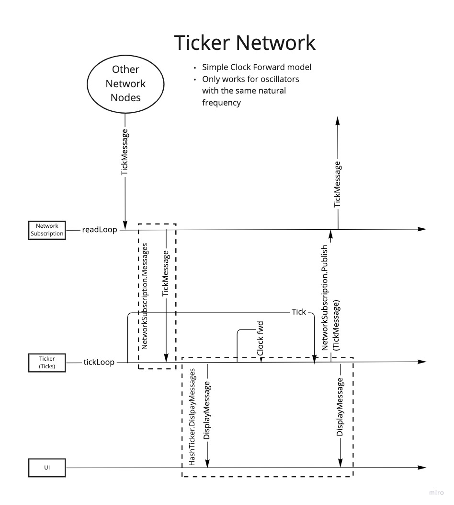

# Ticker Network

A naive attempt to create a network of synchronising oscillators.



## Prior Art
Folly inspired by this [Veritasium video](https://www.youtube.com/watch?v=t-_VPRCtiUg)

Interaction Model inspired by Nicky Case's [Fireflies](https://ncase.me/fireflies/)  ([Code](https://github.com/ncase/fireflies))

## Running

Either run with `go run`, or build and run the binary:

```shell
go run .

# or, build and run separately
go build .
./ticker-network 
```

To set a peer name, use the `-pname` flag:

```shell
go run . -pname=ticker456
```

You can join a specific network topic with the `-topic` flag:

```shell
go run . -topic=tick-testnet
```

If you start two or more instances, the instances should discover each other 
automatically using mDNS and start to synchronise.

To quit, type /quit into the command prompt or enter `Ctrl-C`.
